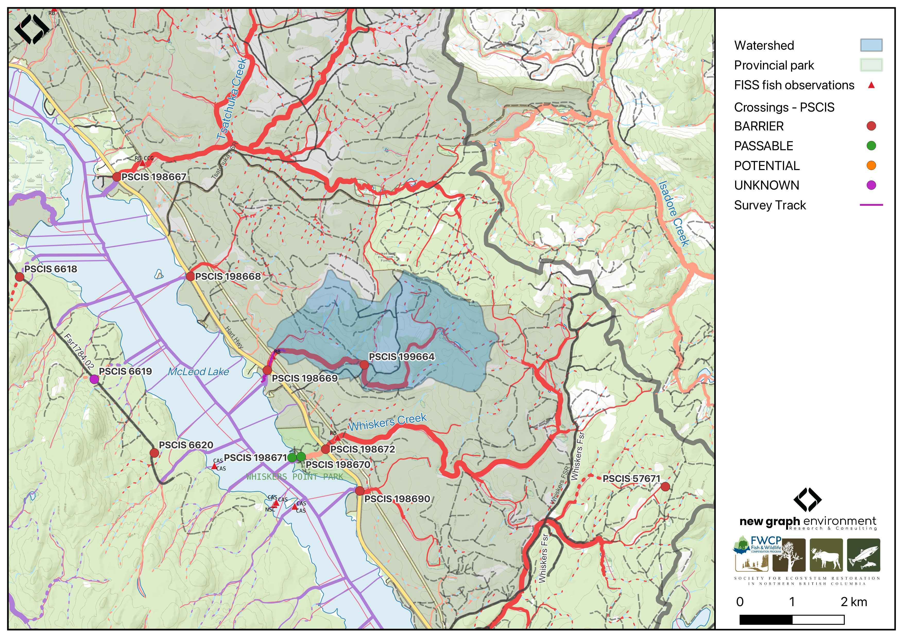

```{r setup-198669, eval = F}
knitr::opts_chunk$set(echo=FALSE, message=FALSE, warning=FALSE)
source('scripts/packages.R')
source('scripts/tables.R')
source('scripts/functions.R')
```

```{r  load-data-198669}
my_site <- 198669
my_site2 <- 199664
```

`r fpr::fpr_appendix_title()`


## Site Location {.unnumbered}

PSCIS crossings `r as.character(my_site)` is located on `r fpr::fpr_my_pscis_info()`, approximately 13km south of the community of McLeod Lake, BC (Figure \@ref(fig:map-198669)). The crossing is located 250m upstream of McLeod Lake, on the `r fpr_my_pscis_info(col_pull = road_name, site = my_site)`, and is within the Carp River watershed group. Crossing `r as.character(my_site)` is the responsibility of the Ministry of Transportation and Infrastructure (chris_culvert_id: 1996861). 

<br>

```{r map-198669, fig.cap = my_caption}
 my_caption <- "Map of Tributary to McLeod Lake"
 
 
 
```

<br>


## Background {.unnumbered}

At this location, `r fpr::fpr_my_pscis_info()` is a
`r fpr::fpr_my_bcfishpass() |>english::ordinal()` order stream and drains a watershed of approximately
`r fpr::fpr_my_wshd()`km^2^. The watershed ranges in elevation from
a maximum of `r fpr::fpr_my_wshd(col = 'elev_max')`m to
`r fpr::fpr_my_wshd(col = 'elev_site')`m near the crossing (Table
\@ref(tab:tab-wshd-198669)).

<br>

In 2023, crossing `r as.character(my_site)` was assessed with a fish passage assessment and was prioritized for follow-up with a habitat confirmation assessment due to the extremely poor condition and size of the culvert, and the presence of quality habitat observed upstream [@irvine_winterscheidt2024RestoringFish]. A habitat confirmation assessment was subsequently conducted in 2024. Upstream of the highway, `r fpr::fpr_my_fish_sp()` have previously been recorded [@norris2024smnorrisbcfishobs; @moe2024KnownBC]. In 2024, a second crossing (PSCIS `r as.character(my_site2)`) was assessed approximately 2.1km upstream of the `r fpr_my_pscis_info(col_pull = road_name, site = my_site)` crossing, and was located on an unnamed FSR.

<br>

```{r tab-wshd-198669, eval = T}
fpr::fpr_table_wshd_sum(site_id = my_site) |>
  fpr::fpr_kable(caption_text = paste0('Summary of derived upstream watershed statistics for PSCIS crossing ', my_site, '.'),
           footnote_text = 'Elev P60 = Elevation at which 60% of the watershed area is above',
           scroll = F)

```

<br>

A summary of habitat modelling outputs for the crossing are presented in Table
\@ref(tab:tab-culvert-bcfp-198669). A map of the watershed is provided in
map attachment
[`r fpr::fpr_my_bcfishpass(col_pull = dbm_mof_50k_grid)`](`r fpr::fpr_my_mapsheet(wshd = "parsnip", archive_date = "2022-05-27")`).

<br>

```{r tab-culvert-bcfp-198669, eval = T}
fpr::fpr_table_bcfp(scroll = F) 
```

<br>


## Stream Characteristics at Crossing `r as.character(my_site)`  {.unnumbered}

At the time of the 2024 assessment, PSCIS crossing `r as.character(my_site)` on the `r fpr_my_pscis_info(col_pull = road_name, site = my_site)` was
un-embedded, non-backwatered and ranked as a
`r fpr::fpr_my_pscis_info(col_pull = barrier_result) |>stringr::str_to_lower()` to upstream fish passage according to the provincial protocols [@moe2011Fieldassessment] (Table \@ref(tab:tab-culvert-198669)). The culvert had a 0.36m outlet drop, a 1m deep outlet pool, and was in extremely poor condition with approximately 2m of the culvert unraveling at the outlet. There were signs of significant erosion around the pipe inlet, suggesting the culvert is undersized for the stream.

<br>

The water temperature was `r fpr::fpr_my_habitat_info(loc = "ds", col_pull = 'temperature_c')`$^\circ$C,
pH was `r fpr::fpr_my_habitat_info(loc = "ds", col_pull = 'p_h')` and
conductivity was `r fpr::fpr_my_habitat_info(loc = "ds", col_pull = 'conductivity_m_s_cm')` uS/cm.

`r if(identical(gitbook_on, FALSE)){knitr::asis_output("\\pagebreak")}`

<br>

```{r tab-culvert-198669, eval = T}
# fpr::fpr_table_cv_summary_memo()

lfpr_table_cv_summary_memo()

```

<br>

```{r eval=F}
##this is useful to get some comments for the report
hab_site |>filter(site == my_site & location == 'ds') |>pull(comments)
hab_site |>filter(site == my_site & location == 'us') |>pull(comments)

```


## Stream Characteristics Downstream of Crossing `r as.character(my_site)` {.unnumbered}

`r fpr_my_survey_dist(loc = 'ds')`, to the confluence with McLeod Lake. The stream had frequent pools, good cover, and abundant gravels, providing `r fpr::fpr_my_priority_info(loc = 'ds') |>stringr::str_to_lower()` value habitat for overwintering and spawning fish. Beaver activity was visible and fish were observed the entire length of the survey `r if(gitbook_on){knitr::asis_output("(Figure \\@ref(fig:photo-198669-01)).")}else(knitr::asis_output("(Figure \\@ref(fig:photo-198669-d01))."))` `r fpr_my_habitat_paragraph(loc = 'ds')`

<br>

## Stream Characteristics Upstream of Crossing `r as.character(my_site)` {.unnumbered}

`r fpr_my_survey_dist(loc = 'us')``r if(gitbook_on){knitr::asis_output("(Figure \\@ref(fig:photo-198669-02)).")}else(knitr::asis_output("(Figure \\@ref(fig:photo-198669-d01))."))` Abundant gravels were present throughout the lower section, providing suitable spawning habitat. Near the powerline corridor, substrate composition transitioned to predominantly fines. Approximately 100m upstream of the transmission line, a 1.2m high beaver dam created a backwatered area. Numerous fish, ranging from 40-120mm, were observed throughout the surveyed section up to the beaver dam. Upstream of the impounded area, the stream returned to predominantly gravel substrates with frequent pools up to 40cm deep. `r fpr_my_habitat_paragraph(loc = 'us')` The habitat was rated as `r fpr::fpr_my_priority_info( loc = 'us') |>stringr::str_to_lower()` value for salmonid spawning and rearing. 

<br>

Approximately 2.1km upstream of the `r fpr_my_pscis_info(col_pull = road_name, site = my_site)` crossing, PSCIS crossing `r as.character(my_site2)` was located on an unnamed FSR. The crossing was ranked as a barrier to upstream fish passage according to the provincial protocols [@moe2011Fieldassessment]. The culvert was poorly installed and in a deteriorated condition, resulting in significant upstream water backup. Habitat was considered medium value, characterized by dense riparian vegetation including shrubs and ferns. Detailed results are provided in [Appendix - Phase 1 Fish Passage Assessment Data and Photos].

<br>

## Structure Remediation and Cost Estimate {.unnumbered}

Should restoration/maintenance activities proceed, replacement of the Hart Highway crossing with a bridge (`r fpr::fpr_my_pscis_info(col_pull = recommended_diameter_or_span_meters)` m span) is recommended. At the time of reporting in 2025, the cost of the work is estimated at \$ `r format(fpr::fpr_my_cost_estimate(), big.mark = ',')`.

<br>


## Conclusion {.unnumbered}

Approximately 5km of bull trout rearing habitat is modelled upstream, and the habitat was rated as medium value for resident salmonid spawning and rearing. The culvert was in extremely poor condition, with a deep outlet pool and significant erosion around the pipe inlet, indicating that the culvert is severely undersized for the stream. The moderate outlet drop likely inhibits juvenile fish passage. The crossing is a `r fpr::fpr_my_priority_info(col_pull = priority) |> stringr::str_to_lower()` priority for replacement. Due to this crossing being situated on the Hart Highway, construction would be complex and costly. Approximately 2.1km upstream, PSCIS crossing `r as.character(my_site2)` was also ranked as a barrier according to provincial protocols, with medium value habitat present at the crossing. 


`r if(gitbook_on){knitr::asis_output("<br>")} else knitr::asis_output("\\pagebreak")`

<br>

```{r tab-habitat-summary-198669, eval = T}
tab_hab_summary |>
  dplyr::filter(Site %in% c(my_site)) |> 
  fpr::fpr_kable(caption_text = paste0("Summary of habitat details for PSCIS crossings ", my_site, "."),
                 scroll = F) 

```

`r if(gitbook_on){knitr::asis_output("<br>")} else knitr::asis_output("\\pagebreak")`

```{r photo-198669-01-prep, eval=T}
my_photo1 = fpr::fpr_photo_pull_by_str(str_to_pull = 'ds_typical_1_')

my_caption1 = paste0('Typical habitat downstream of PSCIS crossing ', my_site, '.')


```

```{r photo-198669-01, fig.cap= my_caption1, out.width = photo_width, eval=gitbook_on}
knitr::include_graphics(my_photo1)
```

<br>

```{r photo-198669-02-prep, eval=T}
my_photo2 = fpr::fpr_photo_pull_by_str(str_to_pull = 'us_typical_2')

my_caption2 = paste0('Typical habitat upstream of PSCIS crossing ', my_site, '.')


```

```{r photo-198669-02, fig.cap= my_caption2, out.width = photo_width, eval=gitbook_on}
knitr::include_graphics(my_photo2)
```

```{r photo-198669-d01, fig.cap = my_caption, fig.show="hold", out.width= c("49.5%","1%","49.5%"), eval=identical(gitbook_on, FALSE)}
my_caption <- paste0('Left: ', my_caption1, ' Right: ', my_caption2)

knitr::include_graphics(my_photo1)
knitr::include_graphics("fig/pixel.png")
knitr::include_graphics(my_photo2)
```
