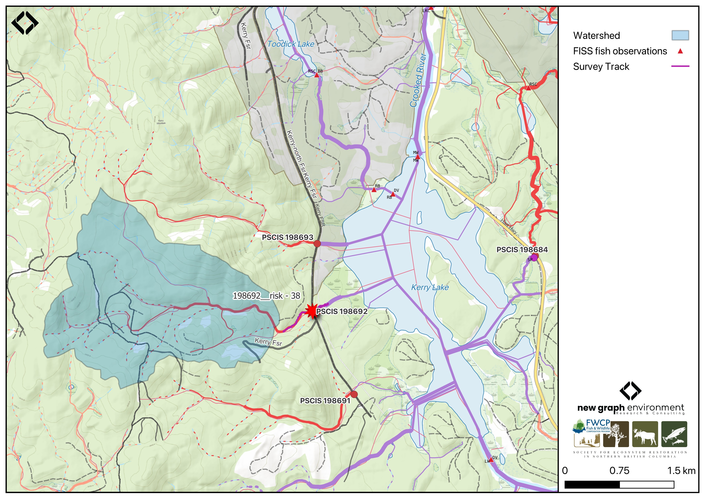

```{r setup-198692, eval = F}
knitr::opts_chunk$set(echo=FALSE, message=FALSE, warning=FALSE)
source('scripts/packages.R')
source('scripts/tables.R')
source('scripts/functions.R')
```

```{r  load-data-198692}
my_site <- 198692
```

# Tributary to Kerry Lake - 198692 - Appendix {- #trib-to-kerry}


## Site Location {.unnumbered}

PSCIS crossings `r as.character(my_site)` is located on `r fpr::fpr_my_pscis_info()`, at kilometer 7 of `r fpr_my_pscis_info(col_pull = road_name, site = my_site)`, approximately 25km north of the community of Bear Lake, BC (Figure \@ref(fig:map-198692)). The crossing is located 750m upstream of the streams confluence with Kerry Lake, on the northwestern side of the lake. Located. At this location, the road is the responsibility of the Ministry of Forests. The crossing is within the Crooked River watershed group.

<br>

```{r map-198692, fig.cap = my_caption}
 my_caption <- "Map of Tributary to Kerry Lake"
 
 
 
```

<br>

## Background {.unnumbered}

At this location, `r fpr::fpr_my_pscis_info()` is a
`r fpr::fpr_my_bcfishpass() |>english::ordinal()` order stream and drains a watershed of approximately
`r fpr::fpr_my_wshd()`km^2^. The watershed ranges in elevation from
a maximum of `r fpr::fpr_my_wshd(col = 'elev_max')`m to
`r fpr::fpr_my_wshd(col = 'elev_site')`m near the crossing (Table
\@ref(tab:tab-wshd-198692)).

<br>

In 2023, crossing `r as.character(my_site)` was assessed with a fish passage assessment and prioritized for follow-up with a habitat confirmation assessment due to the presence of quality habitat observed upstream and its proximity to fish-bearing Kerry Lake [@irvine_winterscheidt2024RestoringFish]. No fisheries data are available for this stream; however, `r fpr::fpr_my_fish_sp(col_pull = observedspp_dnstr)` have been documented in Kerry Lake, located just downstream, in BC Fisheries Information Summary System (FISS) [@norris2024smnorrisbcfishobs; @moe2024KnownBC]. Although Dolly Varden are documented in the Crooked River watershed group, these records are likely misidentifications of bull trout [@bt_cosewic].

<br>

```{r tab-wshd-198692, eval = T}
fpr::fpr_table_wshd_sum(site_id = my_site) |>
  fpr::fpr_kable(caption_text = paste0('Summary of derived upstream watershed statistics for PSCIS crossing ', my_site, '.'),
           footnote_text = 'Elev P60 = Elevation at which 60% of the watershed area is above',
           scroll = F)

```

<br>

A summary of habitat modelling outputs for the crossing are presented in Table
\@ref(tab:tab-culvert-bcfp-198692). A map of the watershed is provided in
map attachment
[`r fpr::fpr_my_bcfishpass(col_pull = dbm_mof_50k_grid)`](`r fpr::fpr_my_mapsheet(wshd = "parsnip", archive_date = "2022-05-27")`).

<br>

```{r tab-culvert-bcfp-198692, eval = T}
fpr::fpr_table_bcfp(scroll = F) 
```

<br>


## Stream Characteristics at Crossing `r as.character(my_site)`  {.unnumbered}

At the time of the 2024 assessment, the crossing on `r fpr_my_pscis_info(col_pull = road_name, site = my_site)` was
un-embedded, non-backwatered and ranked as a
`r fpr::fpr_my_pscis_info(col_pull = barrier_result) |>stringr::str_to_lower()` to upstream fish passage according to the provincial protocols [@moe2011Fieldassessment] (Table \@ref(tab:tab-culvert-198692)). The culvert had a 0.34m outlet drop and a 0.8m deep outlet pool.

<br>

The water temperature was `r fpr::fpr_my_habitat_info(loc = "ds", col_pull = 'temperature_c')`$^\circ$C,
pH was `r fpr::fpr_my_habitat_info(loc = "ds", col_pull = 'p_h')` and
conductivity was `r fpr::fpr_my_habitat_info(loc = "ds", col_pull = 'conductivity_m_s_cm')` uS/cm.

`r if(identical(gitbook_on, FALSE)){knitr::asis_output("\\pagebreak")}`

<br>

```{r tab-culvert-198692, eval = T}
fpr::fpr_table_cv_summary_memo()

```

<br>

```{r eval=F}
##this is useful to get some comments for the report
hab_site |>filter(site == my_site & location == 'ds') |>pull(comments)
hab_site |>filter(site == my_site & location == 'us') |>pull(comments)

```


## Stream Characteristics Downstream of Crossing `r as.character(my_site)` {.unnumbered}

`r fpr_my_survey_dist(loc = 'ds')`. Frequent deep pools provided cover for resident fish and gravels were present for spawning. The habitat was rated as `r fpr::fpr_my_priority_info(loc = 'ds') |>stringr::str_to_lower()` value for anandromous spawning and rearing `r if(gitbook_on){knitr::asis_output("(Figure \\@ref(fig:photo-198692-01)).")}else(knitr::asis_output("(Figure \\@ref(fig:photo-198692-d01))."))` The stream frequently flowed subsurface beginning around 200m downstream of the crossing. `r fpr_my_habitat_paragraph(loc = 'ds')`

<br>

## Stream Characteristics Upstream of Crossing `r as.character(my_site)` {.unnumbered}

`r fpr_my_survey_dist(loc = 'us')`. The stream was noted as having significant flow for the time of year. The habitat was rated as `r fpr::fpr_my_priority_info( loc = 'us') |>stringr::str_to_lower()` value, with patches of gravel suitable for spawning resident rainbow trout and bull trout present `r if(gitbook_on){knitr::asis_output("(Figure \\@ref(fig:photo-198692-02)).")}else(knitr::asis_output("(Figure \\@ref(fig:photo-198692-d01))."))` The stream narrowed into a canyon approximately 150m upstream of Kerry FSR `r if(gitbook_on){knitr::asis_output("(Figure \\@ref(fig:photo-198692-03)).")}else(knitr::asis_output("(Figure \\@ref(fig:photo-198692-d02))."))` `r fpr_my_habitat_paragraph(loc = 'us')` 

<br>

## Fish Sampling {.unnumbered}

```{r eval=F}
# species captured downstream
tab_fish_summary |> 
  dplyr::filter(site_id == paste0(my_site, '_ds')) |> 
  dplyr::group_by(site_id) |> 
  dplyr::distinct(species) |> 
  dplyr::pull(species)

# species captured upstream
tab_fish_summary |> 
  dplyr::filter(site_id == paste0(my_site, '_us')) |> 
  dplyr::group_by(site_id) |> 
  dplyr::distinct(species) |> 
  dplyr::pull(species)

```

Electrofishing was conducted downstream and upstream of the `r fpr_my_pscis_info(col_pull = road_name, site = my_site)` crossing with results summarised in Tables \@ref(tab:tab-fish-site-198692) - \@ref(tab:tab-fish-dens-198692) and Figure \@ref(fig:plot-fish-box-198692). A total of `r tab_fish_summary |> filter(site_id == paste0(my_site, '_ds')) |> group_by(site_id) |> janitor::adorn_totals() |> filter(site_id == 'Total') |> pull(count_fish)` fish were captured downstream and `r tab_fish_summary |> filter(site_id == paste0(my_site, '_us')) |> group_by(site_id) |> janitor::adorn_totals() |> filter(site_id == 'Total') |> pull(count_fish)` fish were captured upstream, all of which were rainbow trout `r if(gitbook_on){knitr::asis_output("(Figure \\@ref(fig:photo-198692-03)).")}else(knitr::asis_output("(Figures \\@ref(fig:photo-198692-d02))."))`

<br>

## Aerial Imagery {.unnumbered}

An aerial survey was conducted with a remotely piloted aircraft and the resulting imagery was processed into an orthomosaic available to view and download `r if(gitbook_on){knitr::asis_output("in Figure \\@ref(fig:uav-ortho-198692)")}else(knitr::asis_output("[here](https://viewer.a11s.one/?cog=https://imagery-uav-bc.s3.amazonaws.com/mackenzie/carp/2024/198692_kerry_lake_trib/odm_orthophoto/odm_orthophoto.tif)"))`.

<br>

```{r uav-ortho-198692-prep, eval = gitbook_on}
viewer_url <- '<iframe src="https://viewer.a11s.one/?cog=https://imagery-uav-bc.s3.amazonaws.com/mackenzie/carp/2024/198692_kerry_lake_trib/odm_orthophoto/odm_orthophoto.tif" scrolling="no" title="UAV Viewer" width="100%" height="600" frameBorder="0"></iframe>'

knitr::asis_output(viewer_url)
```

```{r uav-ortho-198692, out.width = "0.01%", eval = gitbook_on, fig.cap= my_caption}
my_photo = 'fig/pixel.png'

my_caption = paste0('Orthomosaic of PSCIS crossing ', my_site, '.')

knitr::include_graphics(my_photo, dpi = NA)
```

`r if(gitbook_on){knitr::asis_output("<br>")}`

## Structure Remediation and Cost Estimate {.unnumbered}

If there are no plans for further logging in the area, removing the crossing and deactivating the road should be considered as a fish passage remediation option. If logging activities are planned to continue and restoration/maintenance activities proceed, replacement of the `r fpr_my_pscis_info(col_pull = road_name, site = my_site)` crossing with a bridge (`r fpr::fpr_my_pscis_info(col_pull = recommended_diameter_or_span_meters)` m span) is recommended. At the time of reporting in 2025, the cost of the work is estimated at \$ `r format(fpr::fpr_my_cost_estimate(), big.mark = ',')`.

<br>


## Conclusion {.unnumbered}

Approximately 2.3km of bull trout rearing habitat is modelled upstream, and the habitat was rated as `r fpr::fpr_my_priority_info(loc = 'ds') |> stringr::str_to_lower()` value for anadromous spawning and rearing. The 0.34m outlet drop at PSCIS crossing `r as.character(my_site)` likely inhibits juvenile anadromous fish passage and the crossing is rated as a `r fpr::fpr_my_priority_info(col_pull = priority) |> stringr::str_to_lower()` priority for replacement. Although bull trout were not captured at the time of assessment, their absence does not confirm exclusion from the stream. The stream was noted as having significant flow for the time of year, however, flow levels should be further investigated when evaluating the streams importance for bull trout spawning. 

<br>

Located on a low-traffic forest service road, remediation of this crossing would not require significant involvement. The road falls under the tenure of the Ministry of Forests, and if there are no plans for further logging in the area, removing the crossing and deactivating the road could be considered as a fish passage remediation option. If logging activities are planned to continue, opportunities could be explored to collaborate with road tenure holders to replace the crossing.

`r if(gitbook_on){knitr::asis_output("<br>")} else knitr::asis_output("\\pagebreak")`

<br>

```{r tab-habitat-summary-198692, eval = T}
tab_hab_summary |>
  dplyr::filter(Site %in% c(my_site)) |> 
  fpr::fpr_kable(caption_text = paste0("Summary of habitat details for PSCIS crossings ", my_site, "."),
                 scroll = F) 

```

<br>

```{r tab-fish-site-198692, eval=T}
fpr::fpr_table_fish_site()

```

<br>

```{r tab-fish-dens-198692, eval=T}
fpr::fpr_table_fish_density()

```

`r if(gitbook_on){knitr::asis_output("<br>")} else knitr::asis_output("\\pagebreak")`

```{r plot-fish-box-198692, fig.cap= my_caption, eval=T}
my_caption <- paste0('Densites of fish (fish/100m2) captured upstream and downstream of PSCIS crossing ', my_site, '.')

fpr::fpr_plot_fish_box() 

```

<br>

```{r photo-198692-01-prep, eval=T}
my_photo1 = fpr::fpr_photo_pull_by_str(str_to_pull = 'ds_typical_1_')

my_caption1 = paste0('Typical habitat downstream of PSCIS crossing ', my_site, '.')


```

```{r photo-198692-01, fig.cap= my_caption1, out.width = photo_width, eval=gitbook_on}
knitr::include_graphics(my_photo1)
```

<br>

```{r photo-198692-02-prep, eval=T}
my_photo2 = fpr::fpr_photo_pull_by_str(str_to_pull = 'us_typical_1')

my_caption2 = paste0('Typical habitat upstream of PSCIS crossing ', my_site, '.')


```

```{r photo-198692-02, fig.cap= my_caption2, out.width = photo_width, eval=gitbook_on}
knitr::include_graphics(my_photo2)
```

```{r photo-198692-d01, fig.cap = my_caption, fig.show="hold", out.width= c("49.5%","1%","49.5%"), eval=identical(gitbook_on, FALSE)}
my_caption <- paste0('Left: ', my_caption1, ' Right: ', my_caption2)

knitr::include_graphics(my_photo1)
knitr::include_graphics("fig/pixel.png")
knitr::include_graphics(my_photo2)
```

<br>

```{r photo-198692-03-prep, eval=T}
my_photo1 = fpr::fpr_photo_pull_by_str(str_to_pull = 'us_typical_2_')

my_caption1 = paste0('Canyon located approximately 150m upstream of PSCIS crossing ', my_site, '.')


```

```{r photo-198692-03, fig.cap= my_caption1, out.width = photo_width, eval=gitbook_on}
knitr::include_graphics(my_photo1)
```

<br>

```{r photo-198692-04-prep, eval=T}
my_photo2 = fpr::fpr_photo_pull_by_str(str_to_pull = 'fish1')

my_caption2 = paste0('Rainbow trout captured upstream of PSCIS crossing ', my_site, '.')


```

```{r photo-198692-04, fig.cap= my_caption2, out.width = photo_width, eval=gitbook_on}
knitr::include_graphics(my_photo2)
```

```{r photo-198692-d02, fig.cap = my_caption, fig.show="hold", out.width= c("49.5%","1%","49.5%"), eval=identical(gitbook_on, FALSE)}
my_caption <- paste0('Left: ', my_caption1, ' Right: ', my_caption2)

knitr::include_graphics(my_photo1)
knitr::include_graphics("fig/pixel.png")
knitr::include_graphics(my_photo2)
```
