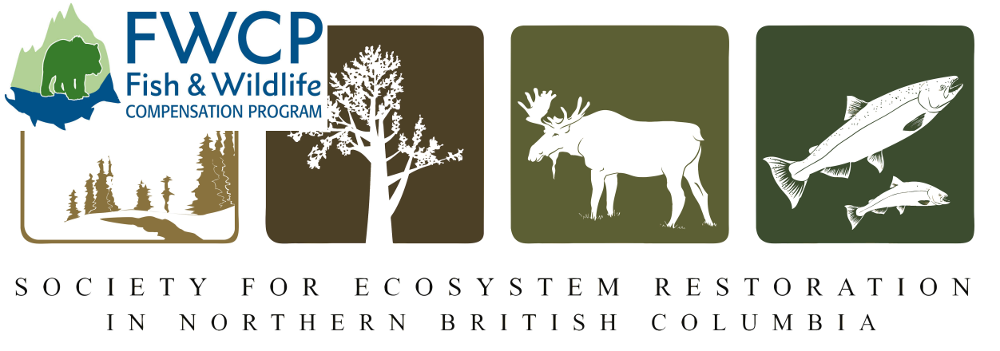
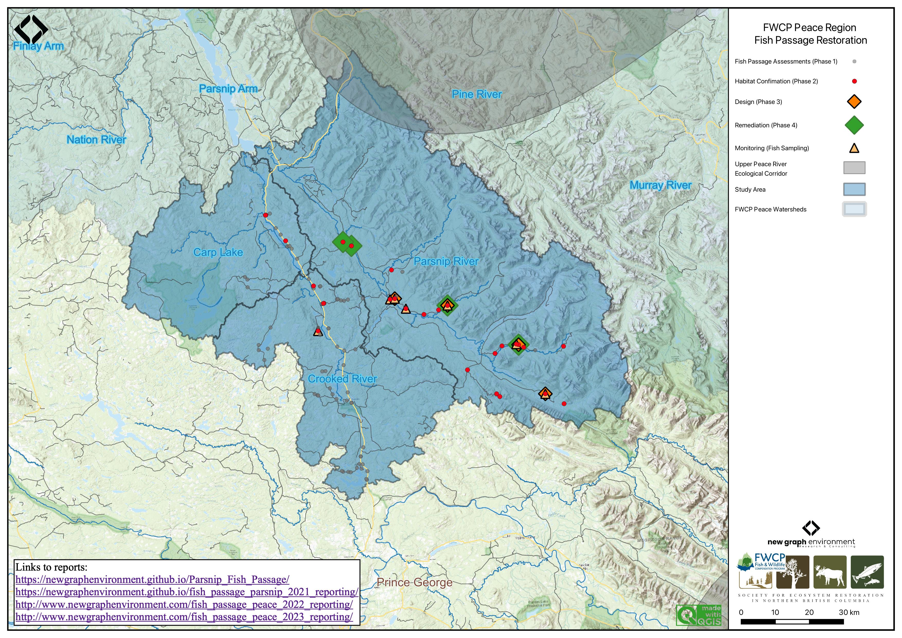
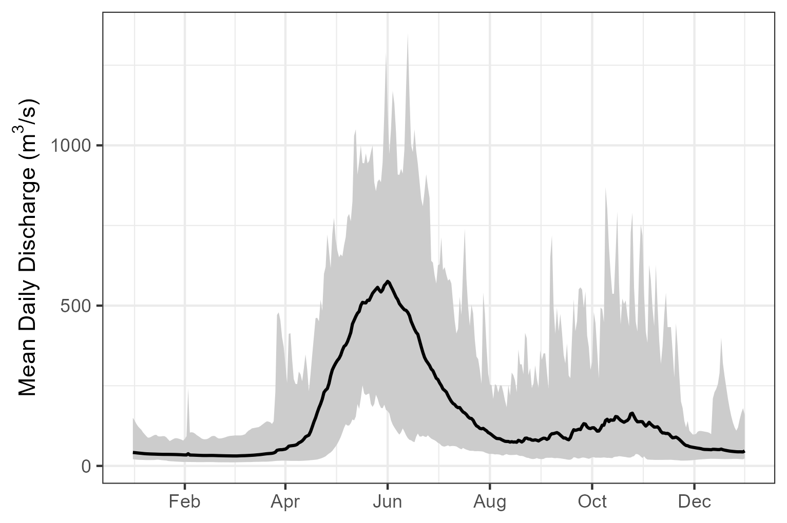
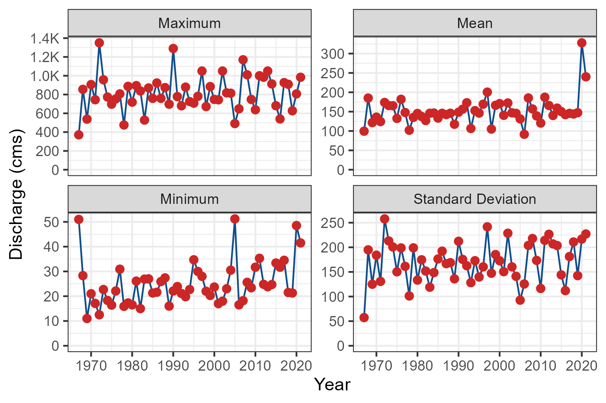

--- 
title: "Restoring Fish Passage in the Peace Region - 2024"
author: |
 |
 | PEA-F24-F-3944-DCA
 |
 | Prepared for
 | Fish and Wildlife Compensation Program 
 |       and  
 | Fish Passage Technical Working Group 
 |
 |
 | Prepared by
 | Al Irvine, B.Sc., R.P.Bio. and Lucy Schick, B.Sc.
 | New Graph Environment Ltd.
 | on behalf of 
 | Society for Ecosystem Restoration in Northern BC
 | 
 | Prepared with financial support of the Fish and Wildlife Compensation Program on
 | behalf of its program partners BC Hydro, the Province of BC, Fisheries and Oceans
 | Canada, First Nations and Public Stakeholders.

date: |
 |
 | DRAFT Version `r desc::desc_get_version()` `r format(Sys.Date(), "%Y-%m-%d")`
toc-title: Table of Contents
site: bookdown::bookdown_site
output: 
  bookdown::gitbook:
          includes:
            in_header: header.html
params:
  repo_url: 'https://github.com/NewGraphEnvironment/fish_passage_peace_2024_reporting'
  report_url: 'https://www.newgraphenvironment.com/fish_passage_peace_2024_reporting/'
  job_name: '2024-073-sern-peace-fish-passage'
  update_form_pscis: TRUE
  update_packages: FALSE
nocite: |
  @busch_etal2011LandscapeLevelModela, 
  @woll_etal2017SalmonEcological,
  @kirsch_etal2014Fishinventory,
  @cooney_holzer2006AppendixInterior,
  @roberge_etal2002LifeHistory,
  @sloat_etal2017Streamnetwork,
  @woll_etal2017SalmonEcological,
  @porter_etal2008DevelopingFish,
  @rosenfeld_etal2000Habitatfactors
documentclass: book
bibliography: "`r rbbt::bbt_write_bib('references.bib', overwrite = TRUE)`"
biblio-style: apalike
link-citations: no
github-repo: rstudio/bookdown-demo
description: "Restoring Fish Passage in the Peace Region"
lof: true

---

```{r switch-gitbook-html, echo=FALSE}
gitbook_on <- TRUE
# gitbook_on <- FALSE  ##we just need turn  this on and off to switch between gitbook and pdf via paged.js

```


```{r jquery, echo=FALSE, eval=FALSE}
#see https://github.com/NewGraphEnvironment/mybookdown-template/issues/16
htmltools::tagList(rmarkdown::html_dependency_jquery())
```


```{r setup, echo=identical(gitbook_on, TRUE), include = TRUE}
knitr::opts_chunk$set(echo=identical(gitbook_on, TRUE), message=FALSE, warning=FALSE, dpi=60, out.width = "100%")
# knitr::knit_hooks$set(webgl = hook_webgl)
options(scipen=999)
options(knitr.kable.NA = '--') #'--'
options(knitr.kable.NAN = '--')
```

```{r settings-gitbook, eval= gitbook_on}
photo_width <- "100%"
font_set <- 11

```

```{r settings-paged-html, eval= identical(gitbook_on, FALSE)}
photo_width <- "80%"
font_set <- 9
```


```{r source}
source('scripts/packages.R')
source('scripts/functions.R')
source('scripts/staticimports.R')
source("scripts/02_reporting/0165-load-sqlite.R")
# source('scripts/tables.R')

```


```{r include=FALSE}
# automatically create a bib database for R packages
knitr::write_bib(c(
  .packages(), 'bookdown', 'knitr', 'rmarkdown'
), 'packages.bib')
```

# Acknowledgement {.front-matter .unnumbered}


Modern civilization has a long journey ahead to acknowledge and address the historic and ongoing impacts of colonialism that have resulted in harm to the cultures and livelihoods living interconnected with our ecosystems for many thousands of years. 


```{js, logo-header, echo = FALSE, eval= T}
title=document.getElementById('header');
title.innerHTML = '' + title.innerHTML
```


<!--chapter:end:index.Rmd-->


# Introduction

The health and viability of freshwater fish populations can depend on access to tributary and off channel areas which
provide refuge during high flows, opportunities for foraging, overwintering habitat, spawning habitat and summer rearing
habitat [@bramblett_etal2002SeasonalUse; @swalesRoleOffChannelPonds1989; @diebel_etal2015EffectsRoad].  Culverts can
present barriers to fish migration due to low water depth, increased water velocity, turbulence, a vertical drop at the
culvert outlet and/or maintenance issues [@slaneyFishHabitatRehabilitation1997; @cote_etal2005Fishpassage]. As road
crossing structures are commonly upgraded or removed there are numerous opportunities to restore connectivity by
ensuring that fish passage considerations are incorporated into repair, replacement, relocation and deactivation
designs.

<br>

The Society for Ecosystem Restoration in Northern BC (SERNbc) is working together with the McLeod Lake Indian Band, the
Peace Region Fish and Wildlife Compensation Program (FWCP), the Provincial Fish Passage Technical Working Group (FPTWG),
road/rail tenure holders and other stakeholders/partners to prioritize, plan and fund the restoration of fish
passage at road crossing structure barriers within the Parsnip River, Carp River and Crooked River watershed groups.

<br>

This project builds on Society for Ecosystem Restoration Northern BC (SERNbc) work in:


- [Parsnip River Watershed – Fish Habitat Confirmations (PEA-F20-F-2967)](https://newgraphenvironment.github.io/Parsnip_Fish_Passage/) [@irvine2020ParsnipRiver],  
- [PEA-F22-F-3577-DCA Restoring Fish Passage in the Peace Region](https://www.newgraphenvironment.com/fish_passage_parsnip_2021_reporting/) [@irvine2022PEAF22F3577DCARestoring]
- [Restoring Fish Passage in the Peace Region - 2022 - PEA-F23-F-3761-DCA](https://newgraphenvironment.github.io/fish_passage_peace_2022_reporting/) [@irvine_winterscheidt2023RestoringFish]  
- [Restoring Fish Passage in the Peace Region - 2023](https://newgraphenvironment.github.io/fish_passage_peace_2023_reporting/) [@irvine_winterscheidt2024RestoringFish]

<br>

Through this year's project activities (2023/2024) we engaged numerous project partners and were able to identify, complete and
catalyze fish passage restoration activities at multiple priority sites. 

<br>

Through the ongoing development of open source analysis, data presentation and project collaboration tools we are 
identifying new restoration opportunities, clarifying restoration benefits, communicating with the broader community and 
implementing on the ground works. 

<br>

`r if(identical(gitbook_on, FALSE))knitr::asis_output("This report is available as pdf and as an online [interactive report](https://newgraphenvironment.github.io/fish_passage_peace_2024_reporting/) at https://newgraphenvironment.github.io/fish_passage_peace_2024_reporting/. We recommend viewing online as the web-hosted version contains more features and is more easily navigable. Please reference the website for the latest version number and download the most up to date pdf from https://github.com/NewGraphEnvironment/fish_passage_peace_2024_reporting/raw/main/docs/Peace2023.pdf")` 

<!-- `r if(identical(gitbook_on, FALSE)){knitr::asis_output("<br>")}` -->

This document can be considered a living document.  Version numbers are logged for each release with modifications, 
enhancements and other changes tracked [here](https://github.com/NewGraphEnvironment/fish_passage_peace_2024_reporting/blob/main/NEWS.md) 
with issues and proposed/planned enhancements tracked [here](https://github.com/NewGraphEnvironment/fish_passage_peace_2024_reporting/issues). 

<!--chapter:end:0100-intro.Rmd-->

# Background

The study area includes the FWCP Peace Region with a focus to date on traditional territories of the Tse'khene First Nations.
In 2023, field assessments were completed with the Parsnip River, Carp River and Crooked River watershed groups (Figure \@ref(fig:overview-map)).  

<br>

In 2019/2020, following a literature review, analysis of fish habitat modelling data, the Provincial Stream Crossing Inventory System (PSCIS) and a community scoping exercise within the McLeod Lake Indian Band habitat confirmation assessments were conducted at 17 sites throughout the Parsnip River watershed with 10 crossings rated as high priorities for rehabilitation and three crossings rated as moderate priorities for restoration. An engineering design for site 125179 on a tributary to the Missinka River was also completed through the 2019/2020 project.  In 2021/2022, project activities reconvened through FWCP directed project PEA-F22-F-3577-DCA. Partners were engaged, funding was raised, planning was conducted and reporting was completed to initiate restoration activities of high priority crossings. Materials were purchased and permitting was put in place to prep for replacement of the twin culverts on the Missinka River tributary with a clear-span bridge.  


<br>

In 2022/2023, this collaborative project leveraged ongoing connectivity restoration initiatives in the province and engaged multiple partners to catalyze fish passage restoration activities at high-priority sites identified in 2019/2020 and 2021/2022. Key accomplishments include the replacement of PSCIS crossing 125179, prioritization of two crossings on the Chuchinka-Table FSR for replacement in 2024-2025 (with engineering designs commissioned and materials purchased), and field assessments including fish sampling at high priority crossing 125000 on a tributary to the Parsnip River near Arctic Lake. 


```{r overview-map, fig.cap = 'Overview map of Study Area',eval=T}

```


<br>

## Tse'khene

The Parsnip River watershed is located within the south-eastern portion of the 108,000 km^2^ traditional territory of the Tse'khene from the [McLeod Lake Indian Band](https://www.mlib.ca/about/History). The Tse'khene *"People of the Rocks"* are a south westerly extension of the Athabascan speaking people of northern Canada.  They were nomadic hunters whose language belongs to the Beaver-Sarcee-Tse'khene branch of Athapaskan [@HistoryWhoWeAre2023].  Extensive work is underway to preserve the language with resources such as First Voices available [online](https://www.firstvoices.com/tsekhene-mcleod) and in [app form](https://apps.apple.com/us/app/tsekhene-mcleod-lake/id1503929250) for iphone and ipad devices.

<br>

The continental divide separates watersheds flowing north into the Arctic Ocean via the Mackenzie River and south and west into the Pacific Ocean via the Fraser River (Figure \@ref(fig:overview-map)). The Parsnip River is a 6th order stream with a watershed that drains an area of 5597km^2^. The mainstem of the river flows within the Rocky Mountain Trench in a north direction into Williston Reservoir starting from the continental divide adjacent to Arctic Lakes. Major tributaries include the Misinchinka, Colbourne, Reynolds, Anzac, Table, Hominka and Missinka sub-basins which drain the western slopes of the Hart Ranges of the Rocky Mountains.  The Parsnip River has a mean annual discharge of `r round(fasstr::calc_longterm_mean(station_number = "07EE007")$LTMAD,1)` m^3^/s with flow patterns typical of high elevation watersheds on the west side of the northern Rocky Mountains which receive large amounts of precipitation as snow leading to peak levels of discharge during snowmelt, typically from May to July (Figures \@ref(fig:fig-hydrology-plot-flow) - \@ref(fig:fig-hydrology-plot-stats)).

<br>

Construction of the 183 m high and 2134 m long W.A.C. Bennett Dam was completed in 1967 at Hudson's Hope, BC, creating the Williston Reservoir [@hirst1991Impactsoperations]. Filling of the 375km^2^ reservoir was complete in 1972 and flooded a substantial portion of the Parsnip River and major tributary valleys forming what is now known as the Peace and Parsnip reaches. The replacement of riverine habitat with an inundated reservoir environment resulted in profound changes to the ecology, resource use and human settlement patterns in these systems [@hagen_etal2015Criticalhabitats; @pearce_etal2019FirstNations; @stamford_etal2017FWCPArctic]. Prior to the filling of the reservoir, the Pack River, into which McLeod Lake flows, was a major tributary to the Parsnip River.  The Pack River currently enters the Williston Reservoir directly as the historic location of the confluence of the two rivers lies within the reservoir's footprint.


<br>


```{r fig-hydrology-plot-flow, eval = T, fig.dim = c(5.1, 3.4), fig.cap='Parsnip River Above Misinchinka River (Station #07EE007 - Lat 55.08194 Lon -122.913063). Available daily discharge data from 1967 to 2019.'}
# knitr::include_graphics("fig/hydrology1-1.png")  ##left this here in case we want to go back to having this build from scratch.

# img <- png::readPNG("fig/hydrology1.png")
# grid::grid.raster(img)



```

<br>

```{r fig-hydrology-plot-stats, fig.dim = c(5.1, 3.4), fig.cap="Summary discharge statistics (annual maximum, minimum, mean and standard deviation) for Parsnip River at hydrometric station #07EE007."}
# img <- png::readPNG("fig/hydrology2.png")
# grid::grid.raster(img)


```

## Fisheries
Fish species recorded in the Parsnip River watershed are detailed in Table \@ref(tab:fiss-species-table) [@data_fish_obs]. In addition to flooding related to the formation of the Williston Reservoir, transmission lines, gas pipelines, rail, road networks, forestry, elevated water temperatures, interrupted connectivity, invasion from non-native species and insect infestations affecting forested areas pose threats to fisheries values in the Parsnip River watershed  [@hagen_2015_critical_habs; @stamford_etal2017FWCPArctic; @bull_trout_synthesis; @bt_cosewic]. A brief summary of trends and knowledge status related to Arctic grayling, bull trout, kokanee, mountain whitefish and rainbow trout in Williston Watershed streams is provided in @fishandwildlifecompensationprogram2020PeaceRegion with a more detailed review of the state of knowledge for Parsnip River watershed populations of Arctic grayling and bull trout provided below.

`r if(gitbook_on){knitr::asis_output("<br>")} else knitr::asis_output("\\pagebreak")`


```{r fiss-species-table}
fiss_species_table <- readr::read_csv(paste0(getwd(), '/data/inputs_extracted/fiss_species_table.csv'))

fiss_species_table %>% 
  fpr::fpr_kable(caption_text = 'Fish species recorded in the Parsnip River, Carp Lake, and Crooked River watershed groups.', 
                 footnote_text = 'COSEWIC abbreviations : 
                 SC - Special concern 
                 DD - Data deficient
                 NAR - Not at risk
                 
                 BC List definitions : 
                 Yellow - Species that is apparently secure 
                 Blue - Species that is of special concern
                 Exotic - Species that have been moved beyond their natural range as a result of human activity
                 ',
                 scroll = gitbook_on)

```


### Bull Trout - sa'ba {-}

Tse'khene Elders from the McLeod Lake Indian Band report that sa'ba (bull trout) size and abundance has decreased in all rivers and tributaries from the reservoir with more injured and diseased fish captured in recent history than was common in the past [@pearce_etal2019FirstNations] . 

<br>

Bull Trout populations of the Williston Reservoir watershed are included within the Western Arctic population 'Designatable Unit 10', which, in 2012, received a ranking of ‘Special Concern’ by the Committee on the Status of Endangered Wildlife in Canada [@cosewic2012COSEWICassessment].  They were added to Schedule 1 under the Species of Risk Act in 2019  [@speciesregistrycanada2020BullTrout] and are also considered of special concern (blue-listed) provincially [@bcspeciesecosystemexplorer2020Salvelinusconfluentus]. Some or all of the long-term foot survey index sections of four Williston Reservoir spawning tributaries (Davis Creek, Misinchinka River, Point Creek, and Scott Creek), have been surveyed within 16 of the 19 years between 2001 and 2019 (16 of 19 in Davis River, 10 years over a 13-year period in the Misinchinka River, 11 years over a 14-year period for Point Creek, and 9 years over an 11-year period for Scott Creek [@hagen_etal2020CriticalSpawning]. 

<br>

A study of sa'ba critical habitats in the Parsnip River was conducted in 2014 with the Misinchinka and Anzac systems identified as the most important systems for adfluvial (large bodied) bull trout spawners.  The Table River was also highlighted as an important spawning destination.  Other watersheds identified as containing runs of large bodied bull troutspawners included the Colbourne, Reynolds, Hominka and Missinka River with potentially less than 50 spawners utilizing each sub-basin [@hagen_etal2015Criticalhabitats].  @hagen_weber2019Limitingfactors have synthesized a large body of information regarding limiting factors, enhancement potential, critical habitats and conservation status for bull trout of the Williston Reservoir and the reader is encouraged to review this work for context.  They have recommended experimental enhancements within a monitoring framework for Williston Reservoir bull trout (some spawning and rearing in Parsnip River mainstem and tributaries) which include stream fertilization, side channel development, riparian restoration and fish access improvement.  

<br>

In 2018, sub-basins of the Anzac River watershed, Homininka River, Missinka River and Table River watersheds were designated as fisheries sensitive watersheds under the authority of the *Forest and Range Practices Act* due to significant downstream fisheries values and significant watershed sensitivity [@anzac_sens; @hominka_sens; @table_sens; @missinka_sens]. Special management is required in these watersheds to protect habitat for fish species including bull trout and Arctic grayling including measures (among others) to limit equivalent clearcut area, reduce impacts to natural stream channel morphology, retain old growth attributes and maintain fish habitat/movement [@fsw_order].    

<br>

### Arctic Grayling - dusk'ihje{-}


Tse'khene Elders from the McLeod Lake Indian Band report that Arctic grayling numbers have declined dramatically since the flooding of the reservoir and that few dusk'ihje (Arctic Grayling) have been caught in the territory in the past 30 years [@pearce_etal2019FirstNations].

<br>

Since impoundment of the Williston Reservoir, it appears that physical habitat and ecological changes have been the most significant factors limiting Arctic grayling productivity. Although these changes are not well understood they have likely resulted in the inundation of key low gradient juvenile rearing and overwintering habitats, isolation of previously connected populations and increases in abundance of predators such as bull trout [@shrimptonj_m__etal2012Geneticanalysis; @hagenTrendAbundanceArctic2018]. Rapid increases in industrial activity and angler access in the Parsnip River watershed pose significant risks to Arctic Grayling productivity with these threats primarily linked to forestry and pipeline initiatives [@hagen_stamford2021ArcticGrayling].

<br>

A detailed review of dusk'ihje life history can be referenced in @stamford_etal2017FWCPArctic. Migration of mature adult
dusk'ihje (Arctic grayling) occurs in the spring with arrival at known spawning locations coinciding with water
temperatures of 4$^\circ$C.  Spawning in the Parsnip watershed appears to occur between late-May and late-June within
sites located primarily within the lower reaches of the Anzac and Table rivers as well as within the Parsnip River
mainstem. Side-channel and multiple-channel locations containing small gravels appear to be selected for spawning.
Currently, the primary distribution of Williston Arctic grayling appears to be among fourth order and larger streams
[@williamson_2004; @stamford_etal2017FWCPArctic]. @stewartFishLifeHistory2007 report that Arctic grayling spawn in large
and small tributaries to rivers and lakes, intermittent streams, within mainstem rivers as well as lakes, most commonly
at tributary mouths.   Although past study results indicate that 0+ grayling appeared to overwinter in lower reaches of
larger tributaries (i.e. Table, Anzac rivers) as well as the Parsnip River and that few age-1+ grayling have been
sampled in tributaries, habitat use in small tributaries and the extent they are connected with the mainstem habitats of
all core areas is not well understood. Between 1995 and 2019, Arctic grayling population monitoring has been conducted
in the Table River in nine out of 25 years (8 years for the Anzac) using snorkel surveys.  Results from 2018 and 2019
are intended to contribute to the assessment of the conservation status of the species in the Parsnip Core area
[@hagenTrendAbundanceArctic2018].  In 2019, preliminary telemetry results indicate that both Arctic grayling and bull
trout rely on the Parsnip River mainstem for overwinter residencies. Arctic grayling move into the tributaries beginning
in April, and become widespread across the watershed by June.

<br>

A 5 year study on Parsnip River watershed dusk'ihje abundance and trend are discussed in
@hagen_stamford2023ParsnipArctic where they report that the most productive habitats for Arctic grayling summer rearing
are within the Anzac River and Table River.  Although estimated abundance is lower than in the Anzac and Table,
productive summer rearing habitats for adult Arctic grayling in the upper Parsnip River watershed are distributed
between 36-25 km of the Missinka River and from 48-32 km of the Hominka River. @hagen_stamford2021ArcticGrayling report
that within the Anzac River, a 30-km stretch from a chute obstruction at 47 km to 16 km is assumed to provide productive
summer rearing habitats for adults as it is characterized by a high abundance of Arctic grayling. Although the spatial
distribution of high Arctic grayling abundance in the Table River has not been determined through reconnaissance surveys
it has been observed to span at least a 20-km zone from the waterfall migration barrier at 37 km to 18 km.

<br>

Spatial ecology studies in the Parsnip between 2018 and 2021 has been reported on by @martins_etal2022SpatialEcology with results related to:

- temperature modeling and spatio-temporal patterns in thermal habitat,
- telemetry data modeling and arctic grayling spatial ecology, and
- trophic relationships between Arctic grayling and bull trout

<br>

A review of available fisheries data for the Parsnip River watershed stratified by different habitat characteristics can provide insight into which habitats may provide the highest intrinsic value for fish species based on the number of fish captured in those habitats in past assessment work (Figures \@ref(fig:fish-plot-grad) - \@ref(fig:fish-plot-wshed)).  It should be noted however that it should not be assumed that all habitat types have been sampled in a non-biased fashion or that particular sites selected do not have a disproportionate influence on the overall dataset composition (ie. fish salvage sites are often located adjacent to construction sites which are more commonly located near lower gradient stream reaches).


<br>

```{r fish-fiss-summary, eval=T}
# fiss_sum <- readr::read_csv(file = paste0(getwd(), '/data/extracted_inputs/fiss_sum.csv'))
fiss_sum_grad <- readr::read_csv(file = paste0(getwd(), '/data/inputs_extracted/fiss_sum_grad.csv'))
fiss_sum_width <- readr::read_csv(file = paste0(getwd(), '/data/inputs_extracted/fiss_sum_width.csv'))
fiss_sum_wshed <- readr::read_csv(file = paste0(getwd(), '/data/inputs_extracted/fiss_sum_wshed.csv')) 
  


# A summary of historical westslope cutthrout trout observations in the Elk River watershed group by average gradient category of associated stream segment is provided in Figure \@ref(fig:fish-wct-bar). Of `r wct_elkr_grad %>% dplyr::filter(gradient_id == 3) %>% pull(total)` observations, `r wct_elkr_grad %>% dplyr::filter(gradient_id == 3) %>% pull(Percent) + wct_elkr_grad %>% dplyr::filter(gradient_id == 5) %>% pull(Percent) + wct_elkr_grad %>% dplyr::filter(gradient_id == 8) %>% pull(Percent)`% were within stream segments with average gradients ranging from 0 - 8%.  A total of `r wct_elkr_grad %>% dplyr::filter(gradient_id == 3) %>% pull(Percent)`% of historic observations were within stream segments with gradients between 0 - 3%, `r wct_elkr_grad %>% dplyr::filter(gradient_id == 5) %>% pull(Percent)`% were within stream segments with gradients ranging from 3 - 5% and `r wct_elkr_grad %>% dplyr::filter(gradient_id == 5) %>% pull(Percent)`% were within stream segments with gradients between 5 - 8% [@data_fish_obs; @norris2020bcfishobs]. 
```

```{r tab-fish-grad}
my_caption <- 'Summary of historic salmonid observations vs. stream gradient category for the Parsnip River watershed group.'
fiss_sum_grad %>% 
  select(-gradient_id) %>% 
  fpr::fpr_kable(caption_text = my_caption,
                 scroll = gitbook_on)
```


<br>


```{r fish-plot-grad, out.width = photo_width, fig.cap= 'Summary of historic salmonid observations vs. stream gradient category for the Parsnip River watershed group.', eval=T}
##bar graph
plot_grad <- fiss_sum_grad %>% 
  dplyr::filter(gradient_id != 99) %>% 
  ggplot(aes(x = Gradient, y = Percent)) +
  geom_bar(stat = "identity")+
  facet_wrap(~species_code, ncol = 2)+
  theme_bw(base_size = 11)+
  labs(x = "Average Stream Gradient", y = "Occurrences (%)")
plot_grad

```


<br>

```{r tab-fish-width}
my_caption <- 'Summary of historic salmonid observations vs. channel width category for the Parsnip River watershed group.'
fiss_sum_width %>% 
  select(-width_id) %>% 
  fpr::fpr_kable(caption_text = my_caption,
                 scroll = gitbook_on)
```

<br>

```{r fish-plot-width, out.width = photo_width, fig.cap= 'Summary of historic salmonid observations vs. channel width category for the Parsnip River watershed group.', eval=T}
##bar graph
plot_width <- fiss_sum_width %>% 
  dplyr::filter(!is.na(width_id)) %>%
  ggplot(aes(x = Width, y = Percent)) +
  geom_bar(stat = "identity")+
  facet_wrap(~species_code, ncol = 2)+
  theme_bw(base_size = 11)+
  labs(x = "Channel Width", y = "Occurrences (%)")
plot_width
```


<br>


```{r tab-fish-wshed}
my_caption <- 'Summary of historic salmonid observations vs. watershed size category for the Parsnip River watershed group.'
fiss_sum_wshed %>% 
  fpr::fpr_kable(caption_text = my_caption,
                 scroll = gitbook_on)
```


<br>


```{r fish-plot-wshed, out.width = photo_width, fig.cap= 'Summary of historic salmonid observations vs. watershed size category for the Parsnip River watershed group.', eval=T}
plot_wshed <- fiss_sum_wshed %>%
  # dplyr::filter(!is.na(upstream_area_ha)) %>%
  ggplot(aes(x = Watershed, y = Percent)) +
  geom_bar(stat = "identity")+
  facet_wrap(~species_code, ncol = 2)+
  theme_bw(base_size = 11)+
  labs(x = "Watershed Area", y = "Occurrences (%)")+
  theme(axis.text.x=element_text(angle = 45, hjust = 1))
plot_wshed
```


<!--chapter:end:0200-background.Rmd-->

# Methods


```{r set-up}
fish_col_permit_num <- "PG23-813101"

```

## Communicate Connectivity Issues 

### Engage Partners 

Engaging partners for ecosystem restoration initiatives is critical as it allows us to utilize available resources, tap
into different areas of expertise, and benefit from diverse perspectives through collaboration that leads to successful
outcomes. Engagement actions have included video conference calls, meetings, emails, presentations and phone calls.

### Collaborative GIS Environment 
Geographical Information Systems are essential for developing and communicating restoration plans as well as the reasons
they are required and how they are developed. Without the ability to visualize the landscape and the data that is used
to make decisions, it is difficult to conduct and communicate the need for restoration, the details of past and future
plans as well as and the potential results of physical works.

<br>

To facilitate the planning and implementation of restoration activities, a collaborative GIS environment has been
established using [QGIS](https://qgis.org/en/site/) and is served on the cloud using source code stored
[here](https://github.com/MerginMaps). This environment is intended to be a space where project team members can access,
view, and contribute to the amalgamation of background spatial data and the development of restoration as well as
monitoring for the project. The collaborative GIS environment allows users to view, edit, and analyze shared, up to date
spatial data on personal computers in an office setting as well as on phones and tablets in the field. At the time of
reporting, the environment was being used to develop and share maps, conduct spatial analyses, communicate restoration
plans to stakeholders as well as to provide a central place to store methodologies and tools for conducting field
assessments on standardized pre-developed digital forms. The platform can also be used to track the progress of
restoration activities and monitor changes in the landscape over time, helping encourage the record keeping of past and
future restoration activities in a coordinated manner.

<br>

The shared QGIS project was created using scripts currently kept in
[`dff-2022`](https://github.com/NewGraphEnvironment/dff-2022) with the precise calls to project creation scripts tracked
in the `project_creation_and_permissions.txt` document kept in the main QGIS project directory. Information about the scripts used for GIS project creation and updates can be viewed
[here](https://github.com/NewGraphEnvironment/dff-2022/tree/master/scripts/qgis) with outcomes of their use summarized
below:

  - Download and clip user specified layers from the [BC Data Catalogue](https://catalogue.data.gov.bc.ca/) as well as data layers stored in custom Amazon Web Services buckets for an area of interest defined by a list of watershed groups and load to a geopackage called `background_layers.gpkg` stored in the main directory of the project.  
  - A project directory is created to hold the spatial data and `QGIS` project information (ie. layer symbology and naming conventions, metadata, etc.).
  - Metadata for individual project spatial layers is kept in the `rfp_tracking` table within the `background_layers.gpkg` along with tables related to user supplied stream width/gradient inputs to `bcfishpass` to model potentially high value habitat that is accessible to fish species of interest. 
  
### Issue Tracking
"Issues" logged on the online github platform are effective ways to track tasks, enhancements, and bugs related to project components.
They can be referenced with the scripts, text and actions used to address them by linking documentation to the issues with text comments
or programatically through `git` commit messages.  Issues for this project are kept [here](paste0('https://github.com/NewGraphEnvironment/',params$job_name,'/issues')).

### Mapping

<!-- Project specific -->
<!-- Maps incorporating the sa'ba (bull trout) spawning and rearing habitat model for the Parsnip River, Carp Lake and -->
<!-- Crooked River watershed groups are served online and were generated using reproducible open source workflows developed -->
<!-- by Hillcrest Geographics.  -->

The workflows to produce the georeferenced  `pdf` maps include using a QGIS layer file
defining and symbolizing all layers required and are continuously evolving. At the time of reporting - mapping scripts
and associated layer file were kept under version control within `bcfishpass` [here](https://github.com/smnorris/bcfishpass/tree/main/qgis).
Loading the QGIS layer file within a QGIS project, allows load and representation of all map component layers provided
the user points to a postgresql database populated via `bcfishpass` outputs.


```{r}
### Interactive Dashboard

# We built an interactive dashboard to allow users to conduct background research and planning to facilitate communication and enable future field surveys in the Peace Region. The interactive interface allows screening of previously inventoried as well as modelled stream crossing locations based on watershed group as well as the likely quantity and quality of bull trout rearing and spawning habitat modelled upstream. Historic assessment data including photos of sites can be viewed when present and through the dashboard users can download csv results and associated georeferenced field maps to facilitate field surveys. The dashboard was built using `R` packages `crosstalk` [@cheng_sievert2022Crosstalk], `DT` [@xie_etal2022interfaceDataTables] and `Leaflet` [@cheng_etal2022InterfaceLeaflet].
```


#### Habitat Modelling

Through this initiative, other SERNbc led initiatives [@irvine2021BulkleyRiver; @irvine2022BulkleyRiver], multi-decade
direction from the Provincial Fish Passage Remediation Program and connectivity restoration planning conducted by
Canadian Wildlife Federation and others [@mazany-wright_etal2021BulkleyRiver; @irvine2022ElkRiver], `bcfishpass` has
been designed to prioritize potential fish passage barriers for assessment or remediation. The software is under
continual development and has been designed and constructed by @norris2021smnorrisbcfishpass using sql and python based
shell script libraries to generate a simple model of aquatic habitat connectivity.  The model identifies natural
barriers (ex. steep gradients for extended distances) and hydroelectric dams to classify the accessibility upstream
by fish [@norris2021smnorrisbcfishpass]. On potentially accessible streams, scripts identify known barriers (ex.
waterfalls >5m high) and additional anthropogenic features which are primarily road/railway stream crossings (i.e.
culverts) that are potentially barriers. To prioritize these features for assessment or remediation, scripts report on
how much modelled potentially accessible aquatic habitat the barriers may obstruct. The model can be refined with
numerous parameters including known fish observations upstream of identified barriers and for each crossing location,
the area of lake and wetland habitat upstream, species documented upstream/downstream, and an estimate of watershed area
(on 2nd order and higher streams).  Furthermore, mean annual precipitation weighted to upstream watershed area, stream
discharge, and channel width can be collated using `bcfishpass`, `fwapg` and `bcfishobs`.  This information can be used
to provide an indication of the potential quantity and quality of habitat potentially gained should fish passage be
restored, by comparing to user defined thresholds for the aforementioned parameters.

 <br>

<!-- Project specific fish species at the end of this paragraph. -->
Regarding gradients, `bcfishpass` calculates the average gradient of BC Freshwater Atlas stream network lines at minimum 100m long intervals starting from the downstream end of the streamline segment and working upstream.  The network lines are broken into max gradient categories with new segments created if and when the average slope of the stream line segment exceeds user provided thresholds. For this phase of the project, the user provided gradient thresholds used to delineate "potentially accessible habitat" were based on estimated max gradients that rainbow trout (20%) and bull trout (25%) are likely to be capable of ascending.

<br>

Gradient, channel size and stream discharge are key determinants of channel morphology and subsequently fish distribution. High value rearing, overwintering, and spawning habitat preferred by numerous species/life stages of fish are often located within channel types that have relatively low gradients and large channel widths (also quantified by the amount of flow in the stream).

<br>

Following delineation of "potentially accessible habitat", the average gradient of each stream segment within habitat classified as below the 20% and 25% thresholds was calculated and summed within species and life stage specific gradient categories.  Average gradient of stream line segments can be calculated from elevations contained in the provincial freshwater atlas streamline dataset.

<br>

To obtain estimates of channel width upstream of crossing locations, where available, `bcfishpass` was utilized to pull average channel gradients from Fisheries Information Summary System (FISS) site assessment data [@moeStreamInventorySample] or PSCIS assessment data [@moe2021PSCISAssessments] and associate with stream segment lines. When both FISS and PSCIS values were associated with a particular stream segment, or multiple FISS channel widths are available a mean of the average channel widths was used.  To model channel width for 2nd order and above stream segments without associated FISS or PSCIS sites, first `fwapg` was used to estimate the drainage area upstream of the segment.  Then, rasters from ClimateBC [@wang_etal2012ClimateWNAHighResolution] were downloaded to a `postgresql` database, sampled for upstream watershed areas associated with each stream segment and a mean annual precipitation weighted by upstream watershed area was calculated. In early 2021, Bayesian statistical methods were developed to predict channel width in all provincial freshwater atlas stream segments where width measurements had not previously been measured in the field.  The model was based on the relationship between watershed area and mean annual precipitation weighted by upstream watershed area [@thorley_irvine2021ChannelWidtha].  In December of 2021, @thorley_irvine2021ChannelWidtha methods were updated using a power model derived by @finnegan_etal2005Controlschannel which relates stream discharge to watershed area and mean annual precipitation. Data (n = 24849) on watershed size, mean annual precipitation and measured channel width was extracted from the provincial freshwater atlas [@flnrord2021FreshwaterAtlasb;  @geobc2022FreshwaterAtlas], the BC Data Catalogue fisheries datasets [@moe2024StreamInventory; @moe2021PSCISAssessments] and @wang_etal2012ClimateWNAHighResolution utilizing `bcfishpass` [@norris2021smnorrisbcfishpass] and `fwapg` [@norris2021smnorrisfwapg]. Details of this analysis and subsequent outputs can be reviewed [here](https://www.poissonconsulting.ca/f/859859031) [@thorley_etal2021ChannelWidthb].

<br>

<!-- Project specific fish species in this paragraph. -->
`bcfishpass` and associated tools have been designed to be flexible in analysis, accepting user defined gradient, channel width and stream discharge categories [@moeStreamInventorySample].  Although currently in draft form, and subject to development revisions, gradient and channel width thresholds for habitat with the highest intrinsic value for a number of fish species in the Parsnip River watershed group have been specified and applied to model habitat upstream of stream crossing locations with the highest potential intrinsic value (Table \@ref(tab:tab-fish-spawning-rearing)). Definitions of modelling outputs for bull trout are presented in Table \@ref(tab:tab-bcfp-def).  Modelling of habitat for Arctic grayling, in the Peace region are planned for 2024-2025 with the work leveraging multiple other initiatives underway by SERNbc and others throughout British Columbia including work related to Arctic grayling habitat use and preference conducted by UNBC and others [@hagen_stamford2023ParsnipArctic; @bottoms_etal2023Criticalhabitats.


<br>

<!-- Turn on once tables.R has been run  -->
<!-- Project specific fish species in this code, must customize to repo -->
```{r tab-fish-spawning-rearing, eval=TRUE}
#`r if(identical(gitbook_on, FALSE)){knitr::asis_output("<br><br><br>")}`

species <- c('BT','GR')

text_footnote <- ""
  #"Models for RB, GR and KO are under a process of development and have not yet been released.  All models parameters are preliminary and subject to collaborative development."


bcfishpass_spawn_rear_model |> 
  dplyr::filter(species_code %in% species) |>
  mutate(Species = fishbc::fbc_common_name(species_code),
         spawn_gradient_max = round(spawn_gradient_max * 100 ,1),
         rear_gradient_max = round(rear_gradient_max * 100 ,1)) |>
  select(Species,
         `Spawning Gradient  Max (%)`= spawn_gradient_max,
         `Spawning Width Min (m)` = spawn_channel_width_min,
         `Rearing Width Min (m)` = rear_channel_width_min,
         # `Spawning Width Max (m)` = spawn_channel_width_max,
         # `Spawning MAD Min (m3/s)` = spawn_mad_min,
         # `Spawning MAD Max (m3/s)` = spawn_mad_max,
         `Rearing Gradient Max (%)` = rear_gradient_max) |>
         # `Rearing MAD Min (m3/s)` = rear_mad_min,
         # `Rearing MAD Max (m3/s)` = rear_mad_max,
         # `Rearing Wetland Multiplier` = rear_wetland_multiplier,
         # `Rearing Lake Multiplier` = rear_lake_multiplier) |>
  t() |>
  as_tibble(rownames = "row_names") |>
  janitor::row_to_names(row_number = 1) |>
  rename(Variable = Species) |>
  fpr::fpr_kable(caption_text = 'Stream gradient and channel width thresholds used to model potentially highest value fish habitat.',
                 footnote_text = text_footnote,
                 scroll = F,
                 scroll_box_height = '300px')

```


`r if(gitbook_on){knitr::asis_output("<br>")} else knitr::asis_output("\\newpage")`

<!-- This table has not been included in the most recent reports (skeena and peace 2023). Maybe because we now use 8.5% for ST rearing habitat, which is not what is referenced in this table (they said 7.5) -->
```{r tab-fish-spawning-rearing-references, eval = TRUE}
# bcfishpass_spawn_rear_model_references <- readr::read_csv(file = 'data/width_modelling/model_spawning_rearing_habitat.csv')
bcfishpass_spawn_rear_model_references <- readr::read_csv(file = 'data/inputs_raw/bcfishpass_spawn_rear_model_ref.csv')
  # select(species_code, contains('ref'), -contains(c('multiplier','mad')))

bcfishpass_spawn_rear_model_references |>
  mutate(Species = fishbc::fbc_common_name(species_code)) |>
  select(Species,
         `Spawning Gradient  Max (%)`= spawn_gradient_max,
         `Spawning Width Min (m)` = spawn_channel_width_min,
         # `Spawning Width Max (m)` = spawn_channel_width_max_ref,
         # `Spawning MAD Min (m3/s)` = spawn_mad_min,
         # `Spawning MAD Max (m3/s)` = spawn_mad_max,
         `Rearing Gradient Max (%)` = rear_gradient_max) |>
         # `Rearing Wetland Multiplier` = rear_wetland_multiplier,
         # `Rearing Lake Multiplier` = rear_lake_multiplier) |>
         # `Rearing MAD Min (m3/s)` = rear_mad_min,
         # `Rearing MAD Max (m3/s)` = rear_mad_max) |>
  t() |>
  as_tibble(rownames = "row_names") |>
  janitor::row_to_names(row_number = 1) |>
  rename(Variable = Species) |>
  fpr::fpr_kable(caption_text = 'References considered for stream gradient and channel width thresholds used to model potentially highest value fish habitat. Preliminary and subject to revisions.',
                 # footnote_text = 'The maximum gradient for steelhead rearing has been adjusted to 8.5% based on professional judgment, although references indicate 7.49%',
                 scroll = F)
```


<br>

<!-- Turn on once tables.R has been run  -->
```{r tab-bcfp-def, eval = TRUE}
fpr::fpr_xref_crossings |>
  dplyr::filter(id_side == 1) |>
  arrange(id_join) |>
  select(Attribute = report, Definition = column_comment) |>
  fpr::fpr_kable(caption_text = 'bcfishpass outputs and associated definitions',
                 footnote_text = 'Bull trout model uses a gradient threshold of maximum 25% to determine if access if likely possible',
                 scroll = gitbook_on)
```


```{r tablethreshaverage, eval= F}
#to quantify upstream habitat potentially available for salmonids and facilitate stream line symbology based on stream morphology.

# while high gradient sections typically  present  upstream  migration  barriers  and  less  available  habitat.  Additionally, the size of the stream (indicated by channel width) is an important determinant for habitat suitability for different species as well as specific life stages of those species. 

# `bcfishpass` was used to categorize and sum potentially accessible stream segments in the study area watersheds within gradient and width categories for each stream segment. 
# (0 - 3%, 3 - 5%, 5 - 8%, 8 - 15%, 15 - 20%) with these outputs further amalgamated to summarize and symbolize potential upstream habitat in three categories: riffle/cascade (0 - 5%), step-pool (5 - 15%) and step-pool very steep (15-20%) (Table \@ref(tab:tablethreshaverage)).  


#threshold and average gradient table
table_thresh_average <- tibble::tibble(`Gradient` = c('0 - 5%', '5 - 15%', '15 - 20%', '>20%'),
                                       `Channel Type` = c('Riffle and cascade pool', 'Step pool', 'Step pool - very steep', 'Non fish habitat'))

table_thresh_average |> 
    fpr::fpr_kable(caption_text = 'Stream gradient categories (threshold and average) and associated channel type.')

```


## Fish Passage Assessments

In the field, crossings prioritized for follow-up were first assessed for fish passage following the procedures outlined in “Field Assessment for Determining Fish Passage Status of Closed Bottomed Structures” [@fish_passage_assessments]. The reader is referred to [@fish_passage_assessments] for detailed methodology.  Crossings surveyed included closed bottom structures (CBS), open bottom structures (OBS) and crossings considered “other” (i.e. fords).  Photos were taken at surveyed crossings and when possible included images of the road, crossing inlet, crossing outlet, crossing barrel, channel downstream and channel upstream of the crossing and any other relevant features.  The following information was recorded for all surveyed crossings: date of inspection, crossing reference, crew member initials, Universal Transverse Mercator (UTM) coordinates, stream name, road name and kilometer, road tenure information, crossing type, crossing subtype, culvert diameter or span for OBS, culvert length or width for OBS.  A more detailed “full assessment” was completed for all closed bottom structures and included the following parameters: presence/absence of continuous culvert embedment (yes/no), average depth of embedment, whether or not the culvert bed resembled the native stream bed, presence of and percentage backwatering, road fill depth, outlet drop, outlet pool depth, inlet drop, culvert slope, average downstream channel width, stream slope, presence/absence of beaver activity, presence/absence of fish at time of survey, type of valley fill, and a habitat value rating.  Habitat value ratings were based on channel morphology, flow characteristics (perennial, intermittent, ephemeral), fish migration patterns, the presence/absence of deep pools, un-embedded boulders, substrate, woody debris, undercut banks, aquatic vegetation and overhanging riparian vegetation (Table \@ref(tab:tab-hab-value)).

<br>


```{r tab-hab-value}
fpr_table_habvalue |>
  knitr::kable(caption = 'Habitat value criteria (Fish Passage Technical Working Group, 2011).', booktabs = T, label = NA) |>
    kableExtra::column_spec(column = 1, width_min = '1.5in') |>
    kableExtra::kable_styling(c("condensed"), full_width = T, font_size = font_set)

```

`r if(gitbook_on){knitr::asis_output("<br>")} else knitr::asis_output("\\pagebreak")`


Fish passage potential was determined for each stream crossing identified as a closed bottom structure as per @fish_passage_assessments.  The combined scores from five criteria: depth and degree to which the structure is embedded, outlet drop, stream width ratio, culvert slope, and culvert length were used to screen whether each culvert was a likely barrier to some fish species and life stages (Table \@ref(tab:tab-barrier-scoring), Table \@ref(tab:tab-barrier-result)). These criteria were developed based on data obtained from various studies and reflect an estimation for the passage of a juvenile salmon or small resident rainbow trout [@clarkinNationalInventoryAssessment2005 ;@bellFisheriesHandbookEngineering1991; @thompsonAssessingFishPassage2013]. For crossings determined to be potential barriers or barriers based on the data, a culvert fix and recommended diameter/span was proposed. 

<br>

```{r tab-barrier-scoring, eval=T}
tab <- as_tibble(t(fpr_table_barrier_scoring)) |>
  mutate(V4 = names(fpr_table_barrier_scoring)) |>
  select(V4, everything()) |>
  janitor::row_to_names(1) |>  ##turn the table sideways
  mutate(Risk = case_when(Risk == 'Value' ~ '  Value',
                          T ~ Risk))

tab |>
  fpr::fpr_kable(caption_text = 'Fish Barrier Risk Assessment (MoE 2011).', scroll = F)

```

<br>


```{r tab-barrier-result}
fpr_table_barrier_result |>
  fpr::fpr_kable(caption_text = 'Fish Barrier Scoring Results (MoE 2011).', scroll = F)

```


<br>

<!-- Project specific fish species in this paragraph. -->
Habitat gain indexes are the quantity of modelled habitat upstream of the subject crossing and represents an estimate of habitat gained with remediation of fish passage at the crossing.  For this project, a gradient threshold between accessible and non-accessible habitat was set at 25% (for a minimimum length of 100m) and intended to represent the maximum gradient of which the strongest swimmers of anadromous species (bull trout) are likely to be able to migrate upstream.  This is the amount of habitat upstream of each crossing less than 25% gradient before a falls of height >5m - as recorded in @ProvincialObstaclesFish or documented in other `bcfishpass` online documentation. For Phase 2 - habitat confirmation sites, conservative estimates of the linear quantity of habitat to be potentially gained by fish passage restoration, bull trout rearing maximum gradient threshold (10.5%) was used. To generate estimates for area of habitat upstream (m^2^), the estimated linear length was multiplied by half the downstream channel width measured (overall triangular channel shape) as part of the fish passage assessment protocol. Although these estimates are not generally conservative, have low accuracy and do not account for upstream stream crossing structures they allow a rough idea of the best candidates for follow up.

<br>


Potential options to remediate fish passage were selected from @fish_passage_assessments and included:

 + Removal (RM) - Complete removal of the structure and deactivation of the road.
 + Open Bottom Structure (OBS) - Replacement of the culvert with a bridge or other open bottom structure.  Based on consultation with FLNR road crossing engineering experts, for this project we considered bridges as the only viable option for OBS type .
 + Streambed Simulation (SS) - Replacement of the structure with a streambed simulation design culvert.  Often achieved by embedding the culvert by 40% or more. Based on consultation with FLNR engineering experts, we considered crossings on streams with a channel width of <2m and a stream gradient of <8% as candidates for replacement with streambed simulations.
 + Additional Substrate Material (EM) - Add additional substrate to the culvert and/or downstream weir to embed culvert and reduce overall velocity/turbulence.  This option was considered only when outlet drop = 0, culvert slope <1.0% and stream width ratio < 1.0.
 + Backwater (BW) - Backwatering of the structure to reduce velocity and turbulence. This option was considered only when outlet drop < 0.3m, culvert slope <2.0%, stream width ratio < 1.2 and stream profiling indicates it would be effective..

 <br>

### Cost Estimates
Cost estimates for structure replacement with bridges and embedded culverts were generated based on the channel width, slope of the culvert, depth of fill, road class and road surface type. Road details were sourced from @flnrordForestTenureRoad2020 and @flnrordDigitalRoadAtlas2020 through `bcfishpass`. Interviews with Phil MacDonald, Engineering Specialist FLNR - Kootenay, Steve Page, Area Engineer - FLNR - Northern Engineering Group and Matt Hawkins - MoTi - Design Supervisor for Highway Design and Survey - Nelson were utilized to helped refine estimates which have since been adjusted for inflation and based on past experience.

<br>

Base costs for installation of bridges on forest service roads and permit roads with surfaces specified in provincial GIS road layers as rough and loose was estimated at \$25000/linear m and assumed that the road could be closed during construction and a minimum bridge span of 15m. For streams with channel widths <2m, embedded culverts were reported as an effective solution with total installation costs estimated at $50k/crossing (pers. comm. Phil MacDonald, Steve Page then adjusted for inflation). For larger streams (>6m), estimated span width increased proportionally to the size of the stream.  For crossings with large amounts of fill (>3m), the replacement bridge span was increased by an additional 3m for each 1m of fill >3m to account for cutslopes to the stream at a 1.5:1 ratio. To account for road type, a multiplier table was generated to estimate incremental cost increases with costs estimated for structure replacement on paved surfaces, railways and arterial/highways costing up to 20 times more than forest service roads due to expenses associate with design/engineering requirements, traffic control and paving.  The cost multiplier table (Table \@ref(tab:tab-cost-mult)) should be considered very approximate with refinement recommended for future projects.


`r if(gitbook_on){knitr::asis_output("<br>")} else knitr::asis_output("\\pagebreak")`

<!-- Turn on once tables.R has been run  -->
```{r tab-cost-mult, eval = TRUE}

sfpr_xref_road_cost() |>
  mutate(cost_m_1000s_bridge = formatC(cost_m_1000s_bridge * 15000, format="d", big.mark=",")) |>
  mutate(cost_embed_cv = formatC(cost_embed_cv * 1000, format="d", big.mark=",")) |>
  rename(
    Class = my_road_class,
    Surface = my_road_surface,
    `Class Multiplier` = road_class_mult,
    `Surface Multiplier` = road_surface_mult,
    `Bridge $/15m` = cost_m_1000s_bridge,
    `Streambed Simulation $` = cost_embed_cv
  ) |>
  dplyr::filter(!is.na(Class)) |>
  mutate(Class =case_when(
    Class == 'fsr' ~ str_to_upper(Class),
    TRUE ~ stringr::str_to_title(Class)),
    Surface = stringr::str_to_title(Surface)
  ) |> 
  # dplyr::filter(Class != 'FSR' & Surface != 'Paved') |>
  fpr::fpr_kable(caption_text = 'Cost multiplier table based on road class and surface type.', scroll = F)
```

## Designs
Engineering designs were conducted by consultants hired by forest licensees with tenure over the roads and/or timber
harvest planned on the roads where work was conducted.  Completed designs are loaded to the PSCIS data portal.

<br>


## Habitat Confirmation Assessments

Following fish passage assessments, habitat confirmations were completed in accordance with procedures outlined in the document “A Checklist for Fish Habitat Confirmation Prior to the Rehabilitation of a Stream Crossing” [@confirmation_checklist_2011]. The main objective of the field surveys was to document upstream habitat quantity and quality and to determine if any other obstructions exist above or below the crossing.  Habitat value was assessed based on channel morphology, flow characteristics (perennial, intermittent, ephemeral), the presence/absence of deep  pools, un-embedded  boulders, substrate, woody debris, undercut banks, aquatic vegetation and overhanging riparian vegetation. Criteria used to rank habitat value was based on guidelines in @confirmation_checklist_2011 (Table \@ref(tab:tab-hab-value)).

<br>

During habitat confirmations, to standardize data collected and facilitate submission of the data to provincial databases, information was collected on ["Site Cards"](https://www2.gov.bc.ca/gov/content/environment/natural-resource-stewardship/laws-policies-standards-guidance/inventory-standards/aquatic-ecosystems). Habitat characteristics recorded included channel widths, wetted widths, residual pool depths, gradients, bankfull depths, stage, temperature, conductivity, pH, cover by type, substrate and channel morphology (among others). When possible, the crew surveyed downstream of the crossing to a minimum distance 300m and upstream to a minimum distance of 500 - 600m. Any  potential  obstacles  to  fish  passage  were  inventoried  with  photos, physical  descriptions  and  locations  recorded on site cards.  Surveyed routes were recorded with time-signatures on handheld GPS units.

<br>

## Fish Sampling

### Electrofishing 
Fish sampling was conducted on a subset of sites when biological data was considered to add significant value to the physical habitat assessment information. Electrofishing was utilized for fish sampling according to stream inventory standards and procedures found in the Reconnaissance (1:20 000) Fish and Fish Habitat Inventory Manual [@resourcesinventorycommittee2001Reconnaissance20a]. A Haltech 2000 backpack electrofisher was used within discrete site units both upstream and downstream of the subject crossing with electrofisher settings and seconds, water quality parameters (i.e. conductivity, temperature and ph), start and end locations, length of site and wetted widths (average of a minimum of three) recorded. 


<!-- We did not use minnow trapping in 2024 and unsure if we will in the future so leaving this commented out for now. Another section to add in the future will be eDNA sampling. -->
<!-- ### Minnowtrapping -->

<!-- In the case where electrofishing was not a sufficient method of fish sampling, such as deep areas, streams with insufficient conductance, or temperatures below 5 degrees, minnowtraps were used.  -->


### Fish Handling and Processing
Captured fish were held in buckets with sufficient water to minimize stress until processing, and multiple buckets were used when catch numbers were high. For each fish captured, fork length, weight and species was recorded with results documented in the fish data submission spreadsheet.

### Pit Tagging

Fish with a fork length greater than 60 mm and belonging to species approved under the scientific fish collection permit `r fish_col_permit_num` were tagged with Passive Integrated Transponders (PIT tags) using the [Abdominal Cavity](https://www.youtube.com/watch?v=9CKZ9yaS5o8) method outlined by Biomark. To anesthetize fish prior to pit tagging, we used a solution of approximately 0.1 mL of clove oil per 1 L of water (1:10,000). This concentration was selected for its efficiency in providing effective sedation with minimal residual effects, making it ideal for studies in which fish are released back into their natural habitats [@fernandes_etal2017efficacyclove]. The clove oil solution was prepared in advance by dissolving pure clove oil in ethyl alcohol in a 1:9 ratio (clove oil: ethyl alcohol) to enhance solubility, then mixed into the water bucket [@fernandes_etal2017efficacyclove]. Fish were immersed in this solution until they reached an appropriate level of anesthesia for handling and then were tagged. To maintain needle sharpness and minimize injury risk, needles were replaced approximately every 10 fish. Each tagged fish was scanned with the PIT reader, and both the PIT tag ID and row ID were recorded. Once tagged, fish were placed into a bucket of fresh water and allowed to recover before being released back into the stream. Fish information and habitat data will be submitted to the province under scientific fish collection permit `r fish_col_permit_num`.


<!-- Project specific contractors in this paragraph. -->
## Remediations
Structure replacement was conducted by contractors hired by Sinclar (forest licensee).  As-built drawings were completed and loaded to the PSCIS data portal.

<br>


## Climate Change Risk Assessment

In collaboration with the Ministry of Transportation and Infrastructure (MoTi), a new climate change replacement program
aims to prioritize vulnerable culverts for replacement (pers. comm Sean Wong, 2022) based on data collected and ranked
related to three categories - culvert condition, vulnerability and priority. Within the "condition" risk category - data
was collected and crossings were ranked based on erosion, embankment and blockage issues.  The "climate" risk category
included ranked assessments of the likelihood of both a flood event affecting the culvert as well as the consequence of
a flood event affecting the culvert.  Within the "priority" category the following factors were ranked - traffic volume,
community access, cost, constructability, fish bearing status and environmental impacts (Table
\@ref(tab:tab-moti-params)). This project is still in its early stages with methodology changes going forward.

<br>


```{r tab-moti-params, eval=T}

# This line can be removed once Table.R is run. Just a work around for now. 
xref_moti_climate_names <- sfpr_xref_moti_climate_names()

xref_moti_climate_names  %>%
  slice(7:nrow(.)) |>
  select(spdsht, report) |>
  rename(Parameter = spdsht, Description = report) |>
  fpr::fpr_kable(caption_text = 'Climate change data collected at MoTi culvert sites', scroll = gitbook_on)

```

<!--chapter:end:0300-methods.Rmd-->

# Results

```{r ld-db}

sites_all <- fpr::fpr_db_query(
  query = "SELECT * FROM working.fp_sites_tracking"
)
```

```{r summarize-sites}

# unique(sites_all$watershed_group_name)


wsg <- c(
              "Parsnip River",
              "Carp Lake",
              "Crooked River"
              )

# more straight forward is new graph only watersheds
# wsg_ng <- "Elk River"

# here is a summary with Elk watershed group removed
sites_all_summary <- sites_all |> 
  # make a flag column for uav flights
  dplyr::mutate(
    uav = dplyr::case_when(
      !is.na(link_uav1) ~ "yes",
      T ~ NA_character_
    )) |> 
  # remove the elk counts
  dplyr::filter(watershed_group %in% wsg) |>
  dplyr::group_by(watershed_group) |> 
  dplyr::summarise(
    dplyr::across(assessment:fish_sampling, ~ sum(!is.na(.x))),
    uav = sum(!is.na(uav))
  ) |> 
  sf::st_drop_geometry() |> 
  # make pretty names
  dplyr::rename_with(~ stringr::str_replace_all(., "_", " ") |> 
                       stringr::str_to_title()) |> 
  # annoying special case
  dplyr::rename(
    `Drone Imagery` = Uav) |> 
  janitor::adorn_totals()
```

```{r tab-sites-sum-cap, results="asis"}
my_caption = "Summary of fish passage assessment procedures conducted in the FWCP Peace Region since 2019."
my_tab_caption()
```

```{r tab-sites-sum}
sites_all_summary |> 
  my_dt_table(
    page_length = 20,
    cols_freeze_left = 0
              )
```

<br>


```{r tab-sites-cap, results="asis"}
my_caption = "Details of fish passage assessment procedures conducted in the FWCP Peace Region since 2019."
my_tab_caption()
```

```{r tab-sites-all}
sites_all |>
  sf::st_drop_geometry() |>
  dplyr::relocate(watershed_group, .after = my_crossing_reference) |> 
  dplyr::select(-idx) |>
  # make pretty names
  dplyr::rename_with(~ . |>
                       stringr::str_replace_all("_", " ") |>
                       stringr::str_replace_all("repo", "Report") |>
                       stringr::str_replace_all("uav", "Drone") |>
                       stringr::str_to_title()) |> 
  # dplyr::arrange(desc(stream_crossing_id)) |> 
  
  my_dt_table(
    cols_freeze_left = 1,
    escape = FALSE
  )
```


<!--chapter:end:0400-results.Rmd-->

`r if (knitr::is_html_output()){ '

# References {-}

<div id="refs"></div>
'}`

<br>

Note that this reference was not actually cited in the body of the report but rather in the `index.Rmd` file `yaml` headerj
under the `no_cite` key.

<!--chapter:end:2000-references.Rmd-->

# Changelog {-}

<!-- NEWS.md is maintained by https://cynkra.github.io/fledge, do not edit -->

### fish_passage_peace_2024_reporting 0.0.2 (2025-01-09) {-}

- initial DRAFT release with progress map and Results summary tables


<!--chapter:end:2090-report-change-log.Rmd-->


# Session Info {-}

Information about the computing environment is important for reproducibility. A summary of the computing environment 
is saved to `session_info.csv` that can be viewed and downloaded from `r paste0(params$repo_url, "session_info.csv")`.

```{r session-info}

if(gitbook_on){
  devtools::session_info(to_file = 'session_info.csv')
} else {
  devtools::session_info()
}

```

<!--chapter:end:2100-session-info.Rmd-->

